<picture>
  <source media="(prefers-color-scheme: dark)" srcset="assets/hero-dark.svg">
  <source media="(prefers-color-scheme: light)" srcset="assets/hero-light.svg">
  
</picture>

<picture>
  <source media="(prefers-color-scheme: dark)" srcset="assets/h-patch-dark.svg">
  <source media="(prefers-color-scheme: light)" srcset="assets/h-patch-light.svg">
  
</picture>

<picture>
  <source media="(prefers-color-scheme: dark)" srcset="assets/patch-dark.svg">
  <source media="(prefers-color-scheme: light)" srcset="assets/patch-light.svg">
  
</picture>

<picture>
  <source media="(prefers-color-scheme: dark)" srcset="assets/h-scars-dark.svg">
  <source media="(prefers-color-scheme: light)" srcset="assets/h-scars-light.svg">
  
</picture>

```text
wireguard  the default port got blocked by an ISP. a custom high port fixed it
swapfile   fallocate lies on XFS. dd the file, and never swapoff under pressure
backup     tar --one-file-system quietly skips bind mounts. check what you ship
monitoring a FAIL on a live database or redis dump is just a file changing mid-read
```

<picture>
  <source media="(prefers-color-scheme: dark)" srcset="assets/h-end-dark.svg">
  <source media="(prefers-color-scheme: light)" srcset="assets/h-end-light.svg">
  
</picture>

<picture>
  <source media="(prefers-color-scheme: dark)" srcset="assets/signoff-dark.svg">
  <source media="(prefers-color-scheme: light)" srcset="assets/signoff-light.svg">
  
</picture>

<p align="center">
  <a href="mailto:arsam12sb@gmail.com">arsam12sb@gmail.com</a>
</p>
