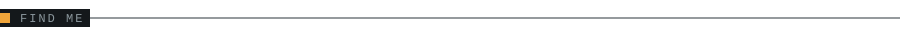

<picture>
  <source media="(prefers-color-scheme: dark)" srcset="assets/hero-dark.svg">
  <source media="(prefers-color-scheme: light)" srcset="assets/hero-light.svg">
  
</picture>

<picture>
  <source media="(prefers-color-scheme: dark)" srcset="assets/now-dark.svg">
  <source media="(prefers-color-scheme: light)" srcset="assets/now-light.svg">
  
</picture>

- Running my own infrastructure: VPN tunnels, reverse proxies, scheduled backups
- Wiring small services together with systemd units, webhooks and shell
- Writing down the gotchas so the next outage is shorter

<picture>
  <source media="(prefers-color-scheme: dark)" srcset="assets/stack-dark.svg">
  <source media="(prefers-color-scheme: light)" srcset="assets/stack-light.svg">
  
</picture>

  
  
  
  
  
  

<picture>
  <source media="(prefers-color-scheme: dark)" srcset="assets/find-dark.svg">
  <source media="(prefers-color-scheme: light)" srcset="assets/find-light.svg">
  
</picture>

Pinned repositories sit directly below this README. Email: <arsam12sb@gmail.com>
